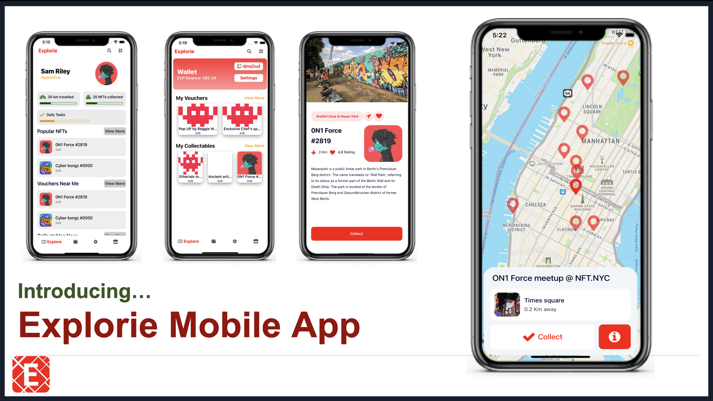

# explorie-nft-mobile

### Introduction
An NFT platform connecting brands to people through NFT vouchers and collectables. By using geo-tagged NFTs, we encourage ‘Pokemon Go’ inspired exploration of neighbourhoods and streets.
* [Hackathon Article](https://news.smu.edu.sg/news/2021/11/10/smu-team-bags-us100000-seed-funding-develop-nft-platform-international-hackathon)
* [Mobile App - explorie-nft-mobile (this repo)](https://github.com/jonathanchowjh/explorie-nft-mobile)
* [Whitepaper - Hack! Cardano](https://docs.google.com/document/d/1icdLZj9oOVM4EatDzIAjqqaYFevsHM0cuwCzsfgP2p8/edit?usp=sharing)
* [Pitchdeck - Hack! Cardano](https://drive.google.com/file/d/1oaYbIqylIBtEr2xg9Bbuw5I2L5qwA36-/view?usp=sharing)

Explorie’s mission is to be an NFT platform with real-life utilities. It seeks to encourage exploration and adventure. Users can download the Explorie app and venture outside their doors. Collectable geo-tagged NFTs will be available around the neighbourhood, which players can redeem. These NFTs can be in the form of vouchers from retail businesses such as restaurants, stores and theme parks, collectables such as limited edition digital pets as well as digital art. This can also promote health and wellness through NFT gamification.

<p align="center">
  
</p>

### Installation
```
git clone https://github.com/Explory/explory-app.git
// install node https://nodejs.org/en/download/
// Ios, install xcode simulator
// Andriod, install android studio emulator

npm i
npm i -g expo

npm run ios         // for ios
npm run android     // for andriod
```
